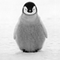

# session-3

Utilisation d'image, chemins relatifs et absolus, galleries photos.

## Intégrer des contenus externes

En HTML, il est facile d'intégrer des contenus externes à votre page.
Ces contenus peuvent être des images, des sons, des videos, des iframes, etc.

Pour intégrer ces contenus dans votre page, il est important de connaître leur emplacement.
Ils peuvent être hebergé depuis le même repertoire que votre site, dans un repertoire
 parent ou depuis un site externe.

### Chemin relatif

Lorsque vous faites référence à un contenu par rapport à votre page HTML,
on le chemin utilisé est dit "relatif". C'est à dire, relatif à votre page.

Par exemple:

* si l'image est dans le même dossier, son chemin est `chat.jpg`
* si l'image est dans un sous-dossier "images", son chemin est `ìmages/chat.jpg`
* si l'image est dans le dossier parent, son chemin est `../chat.jpg`
* si l'image est dans un dossier adjacent (même parent), son chemin est `../images/chat.jpg`

*:warning: Attention si vous déplacez votre fichier HTML, par exemple dans un sous-dossier,
veillez à ce que les chemins relatifs présents dans votre fichier n'aient pas changé.
Le cas échéant il faudra mettre à jour tous vos chemins relatifs*

### Chemin absolu

Lorsque le contenu auquel vous faites référence est hébergé sur un autre site Internet,
on doit utiliser un chemin absolu. Ce chemin spécifie l'adresse exacte d'un contenu.
Vous êtes habitués à ce genre de chemin puisque se sont les mêmes que ceux utilisés
sur Internet dans n'importe quel lien.

Voici plusieurs exemple de lien absolu:

* https://github.com/pirhoo/v2.pirhoo.com/raw/master/src/assets/images/penguin.jpg
* https://i.imgur.com/WdtOUOb.jpg

### Liens hypertextes

Comme nous l'avons vu auparavant, il est possible de faire un lien (absolu) vers
n'importe quel site Internet en utilisant la balise `a`. Vous pouvez égualement
utiliser des chemins relatifs dans vos lien pour faire référence à d'autres
fichiers HTML.

Par exemple si vous avez cette structure de fichiers:

```
.
├── chapitres
|   ├── chapitre-1.html
|   ├── chapitre-2.html
|   ├── chapitre-3.html
|   └── chapitre-4.html
├── images
|   └── lilbub.jpg
|   ├── penguin-mini.jpg
|   ├── penguin.jpg
└── index.html
```

Voici la représentation de cette structure dans `index.html` :

```html
<ul>
  <li>
    <a href="chapitres/chapitre-1.html">Chapitre 1</a>
  </li>
  <li>
    <a href="chapitres/chapitre-2.html">Chapitre 2</a>
  </li>
  <li>
    <a href="chapitres/chapitre-3.html">Chapitre 3</a>
  </li>
  <li>
    <a href="chapitres/chapitre-4.html">Chapitre 4</a>
  </li>
</ul>
```

Chacun des chapitres peut aussi faire référence au sommaire et aux autres chapitres :

```html
<h1>Chapitre 1</h1>

<p>Aliquam erat volutpat. Morbi gravida velit nisl. Duis facilisis aliquam nisi, ut auctor metus. Curabitur ex diam, mollis at odio sit amet, posuere hendrerit massa. Cras mi nisl, gravida quis orci sed, consequat sagittis est. Mauris ante magna, sagittis sit amet maximus nec, accumsan non urna. Aenean eget ipsum pretium, pretium tortor non, aliquet elit. Phasellus tempor quam ante, id scelerisque felis commodo et. Nulla vehicula sodales sapien vel scelerisque. Duis vestibulum a lacus in euismod. Etiam tincidunt elementum mattis. Nulla iaculis pellentesque consectetur.</p>

<ul>
  <li>
    <a href="chapitre-2.html">Chapitre suivant</a>
  </li>
  <li>
    <a href="../index.html">Retour au sommaire</a>
  </li>
</ul>
```

### Intégrer des images

La base `img` est très proche de la balise `a`. Elle accepte des chemins absolus
ou relatifs via l'attribut `src` :

```html


```

En théorie, il faut systématiquement utilise l'attribut `alt` pour décrire l'image.
Cette description est utilisés par les liseuses d'écran pour les mal-voyants. Ce
texte *alternatif* est aussi affiché à la place de l'image lorsque celle-ci ne
se charge pas correctement (mauvais lien, image corrompue, etc).

```html

```

### Faire une image cliquable

Dans de nombreuses situations, vous pouvez avoir besoin de créer une images cliquable.
Cela peut être utile lorsque par exemple vous voulez afficher une miniature et la
rendre cliquable pour afficher l'image dans sa taille originale.

Pour redimensionner l'image, il est possible d'utiliser une hauteur ou une largeur fixe
à l'aide des attributs `width` et `height` qui définissent la taille de l'image en pixels.
Si vous définissez uniquement l'un de ces deux attributs, l'image sera redimensionnée de manière
homotétique, c'est à dire sans la déformer.

```html
<p>Aliquam erat volutpat. Morbi gravida velit nisl. Duis facilisis aliquam nisi, ut auctor metus. Curabitur ex diam, mollis at odio sit amet, posuere hendrerit massa. Cras mi nisl, gravida quis orci sed, consequat sagittis est.</p>

<a href="images/penguin.jpg" target="_blank">
  
</a>
```

Redimensionner l'image directement en HTML n'est pas un bonne pratique, surtout
si votre image est très grande et longue à télécharger. Par conséquent il est recommandé
d'utiliser une image redimensionnée au préalable avec Photoshop ou n'importe quel
site d'édition d'image (comme [ResizeImage](http://resizeimage.net)).


```html
<p>Aliquam erat volutpat. Morbi gravida velit nisl. Duis facilisis aliquam nisi, ut auctor metus. Curabitur ex diam, mollis at odio sit amet, posuere hendrerit massa. Cras mi nisl, gravida quis orci sed, consequat sagittis est.</p>

<a href="images/penguin.jpg" target="_blank">
  
</a>
```
